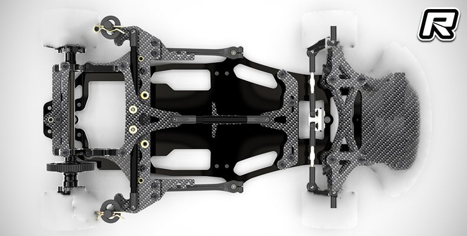

***

# **Build Guide**

This is the build guide for our 2022 WRO Future Engineers design - Spark Plugs. It is segmented into four main steps, with more detailed steps within.

## Print Parts

Before starting assembly, be sure to 3D print all of the 3D-printed parts below:
* [Platform](https://github.com/definitely-nobody-is-here/SPARK_Future-Engineers_2022/raw/master/Documentation/CAD/SPARK2022_platform.stl)
* [Camera Mount](https://github.com/definitely-nobody-is-here/SPARK_Future-Engineers_2022/raw/master/Documentation/CAD/SPARK2022_cameramount.stl)
* [Camera LED Clip](https://github.com/definitely-nobody-is-here/SPARK_Future-Engineers_2022/raw/master/Documentation/CAD/SPARK2022_cameraLEDmount.stl)
* [Rear Wheel Rim](https://github.com/definitely-nobody-is-here/SPARK_Future-Engineers_2022/raw/master/Documentation/CAD/SPARK2022_rearwheelrim.stl) (if using the 1 in rubber tires)

You can start building while these are printing.

## Assemble Chassis Kit

Our design is built on top of a [Schumacher Atom 2 S2 GT12 Pan Car Kit](https://www.amainhobbies.com/schumacher-atom-2-s2-1-12-gt12-competition-pan-car-kit-schk179/p1055346). Follow the instructions in the box until the step to attach the bumper, which is omitted in our build. Make sure to replace the stock 64-tooth spur gear with a [78-tooth spur gear](https://www.amazon.com/Kimbrough-Pitch-Spur-Gear-78T/dp/B0006O1QVM). Also, remove one layer of spacers from the front suspension to raise the front ride height (the weight of the added componenents cause the front suspension to sag).

At this point, the car should look like the car on the box, except without wheels or a bumper.

*This image is an edited version of a photo of the carbon fiber edition. It's not ours, we just don't have a picture of this step.*

Take the rear rims and fit the tires onto them. Instructions to attaching wheels are in the kit's instruction packet; follow those to secure the wheels.

## Attach Servo, ESC, and Motor

Use the two included screws in the kit to mount the [Fantom ICON sensored brushless motor](https://fantomracing.com/shop/motors/spec-motors/25-5-icon-torque-works-edition/) to the motor bracket. Then, align the [12-tooth pinion gear](https://www.amazon.com/Traxxas-PINION-PITCH-SCREW-2428/dp/B00EFXMUO2) on the motor shaft and turn the set screw to lock it in place. The servo is placed in the servo bracket (specifics are included in the kit instructions). DO NOT tighten the servo horn to the gear yet, as it must first be centered in order for steering to work. The [HobbyWing Q10BL60 ESC](https://www.hobbywingdirect.com/products/quicrun-10-sensored) can be attached to the forward section using the VHB tape included with it. Make sure to solder the wires in the correct order, or the motor may not rotate. The capacitors for the ESC can be double-sided taped to the forward section as well.

*Our build uses a different 25.5T brushless motor from HobbyWing but we had to modify our chassis to make it fit. The code will still work with the motor in these instructions.*

## Solder Electrical Components

#### Connectors and Voltage Regulator Adjusting

On the ends of the power leads of the ESC, solder a female XT60 connector and four 20-gauge wires - two on power and two on ground. Make sure it's polarized the same way as the batteries or you risk breaking things. Solder the 20-gauge wires to the inputs of the two [voltage regulators](https://www.amazon.com/Regulator-Adjustable-Converter-Electronic-Stabilizer/dp/B07PDGG84B/ref=sr_1_18). **Ensure that the polarity is correct while soldering.** Power the regulators by plugging a battery in to the XT60 connector, and change the output voltage of the regulators to 7.4V and 5V. For more information see [this guide by Robottronic](https://www.instructables.com/How-to-Use-DC-to-DC-Buck-Converter-LM2596/).

## Voltage Regulators

On the output of the 7.4V regulator, solder two single-pin headers. Now, attach the [digital voltometer](https://www.amazon.com/bayite-Digital-Voltmeter-Display-Motorcycle/dp/B00YALUXH0/). On the input, solder the ground wire (black) to the negative terminal, and the power and source wires (red and white) to the positive terminal. On the output of the 5V regulator, solder the [DC barrel jack](https://www.amazon.com/Pigtails-Female-Connector-Pigtail-Security/dp/B08PYWN3T7/) (again, making sure that the polarity is correct). The 7.4V regulator outputs should have two male Dupont connectors soldered to them, facing upwards. This is to make plugging the servos in easier.

## Wiring

soldering, crimping

LIGHTS NO MORE

crimp indicators, button, jumpers, optional wifi stuff

ensure that power, ground, and PWM wires are labeled

## Jetson NANO

TODO: attach fan, follow instructions to set up OS, create task to run startup.py on startup, switch to text-only mode

Add the [Noctua NF-A4X10 5V PWM fan](https://noctua.at/en/products/fan/nf-a4x10-5v) to the board using M3x20mm nylon screws

## Platform Standoffs

Follow the diagram below to place the spacers and standoffs for the mounting of the upper platform and camera. The rear two are spacers, and the other six will replace existing screws.

Use the diagram below to fill in the standoffs on the top platform. All standoffs in green are M3x6mm nylon standoffs, and the blue are M2.5x5mm brass spacers (included with Jetson NANO). Use M3 nylon nuts to hold the nylon standoffs onto the board and use 8mm M2.5 screws to hold the brass spacers onto the board.

*Note: Platform in diagram is of a slightly older design of V5. Standoff and spacer locations still apply.*

## Top Platform Assembly

Place the top platform assembly on top of the 25mm/20mm brass standoffs mentioned [earlier](#platform-standoffs). Screw them in using M3x6mm countersunk screws. Route the wires through the provided cable management holes. The way they are routed doesn't matter, but the use the image below for a general guide on routing wires. The [voltage regulators](#voltage-regulators) are attached to the [diagonal nylon spacers (image 2, red)](#platform-standoffs) with 6mm M3 nylon screws, with the outputs facing toward the side with the [button and indicator LEDS](#wiring), as well as the 5V regulator being in the front (narrow end) and the 7.4V regulator in the back (LED indicator end). The voltometer](https://www.amazon.com/bayite-Digital-Voltmeter-Display-Motorcycle/dp/B00YALUXH0/) goes on the [two nylon standoffs (image 2, red)](#platform-standoffs) on the input side of the 7.4V regulator.

Place the [assembled Jetson NANO](#jetson-nano) on the [four brass standoffs (image 2, blue)](#platform-standoffs) and secure with the provided M2.5x5mm screws. If there is a [WiFi card](https://www.newegg.com/p/0XM-009Y-001C7), route the antenna cables to the rear (right of image) and attach to the holders.

## Plugging it All In

check wiring

