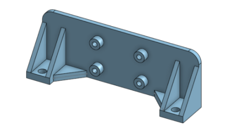
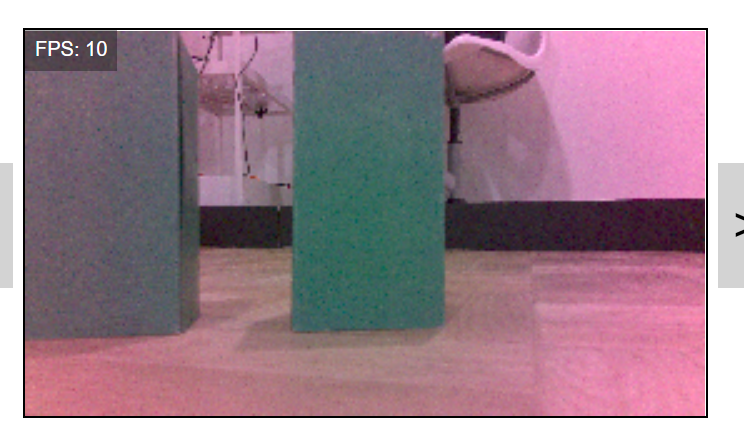

# July 2022
SPARK WRO 2022 Future Engineers Engineering Notebooks

***

# 8/1/22
At this point we are trying to make the car drive around traffic signals. We added the detection for traffic signals and turning accordingly. We encountered some conflicts, where the car would have to turn left but refuse to since it wants to stay in the center of the path. Sometimes the traffic signals would appear too small in the filtered image and then blob detection ignore it, assuming that it's a filtering error. There were other issues, like typos. Those were relatively simple fixes, and now we can reliably sort of drive around the course.

# 8/4/22
Today we fixed some bugs and added a live video stream from the car. The blob detector had an issue where if the blob is touching the edge of the image, it wouldn't detect it. We solved this using cv2 to create a border around the image. We added a live video stream from the car to make debugging easier, since it can display the live feed from the camera, the filtered image that the car processes, and the blobs detected, all on the screen. In the future we plan to display more data on the screen.

In other news, we orded a wide-angle camera, and it arrived today. A new mount was 3D-printed to accomodate the larger lens (huge in comparison to the narrow-frame IMX219).

# 8/5/22
We attempted to switch to the wide-angle camera, but the edges of the image are tinted pink. So, we can't use it.

In other news...
The car now drives exceptionally well.

We changed the steering values from an absolute return value to a weighted value; the steering values are scaled by size (which is correlated to distance) from the car. When the car is further away from something, it has less incentive to turn. Turn values are calculated individually for the red signals, green signals, left wall, and right wall. The program determines the final steering value by choosing the steering value that has the largest absolute value. This reduces the chances that the car overcorrects and ends up turning so far it can't recover before hitting a wall, and also prevents premature and most unneccesary turns.

# 8/8/22
Our camera broke and we got new signals. Again. The new red signals are unusually orange, leading to the filter detecting people's skin as red. We tuned the filter again and discovered some new problems. The program doesn't do any localization, so once it stops detecting something, it completely forgets it exists. We can add a simple memory system that "remembers" that it saw a signal, and will continue to act as if it is on screen for some time after it stops detecting it, preventing it from turning and running over a traffic signal as soon as it's out of view.

# 8/12/22
Today we installed a wide-angle camera. To us, distortion is not an issue, since the size of objects will be the same as long as the distance is the same, and that's all we need. We just have to recalculate the inequalities used for predicting collisions.

8/13/22
Tuning the prediction - We added a check for whether a wall was the inner wall or outer wall. When the car drives straight towards a wall, it cannot use the slope of the wall to decide whether it is the inner or outer walls.