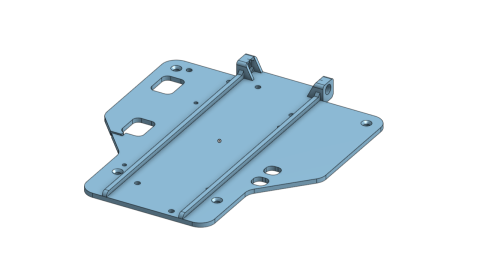
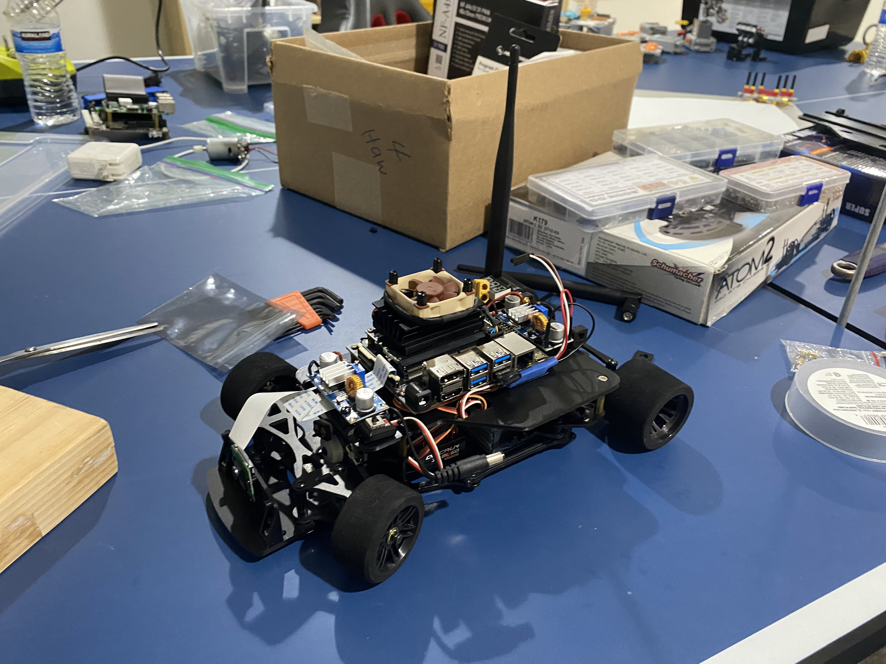
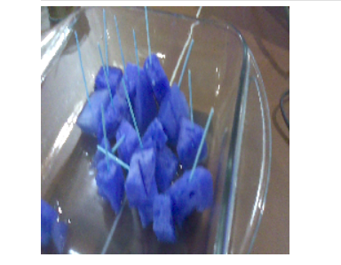
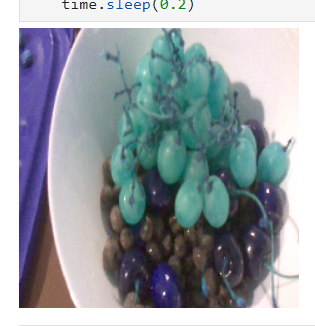
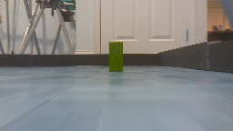
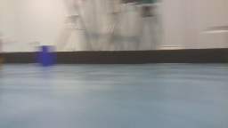
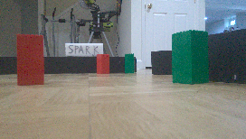
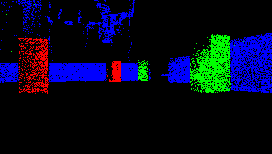
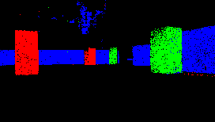

# July 2022
SPARK WRO 2022 Future Engineers Engineering Notebooks

***

# 7/2/22
We attempted to get the Jetson to boot off of a USB drive, as the built-in EMMC doesn't have enough capacity to install the Jetpack SDK. The large 78-tooth diff gear was installed as well.

### Updates
* Successfully changed the boot manager to boot from USB
* 78-tooth diff gear installed

There were issues installing it, as before in mid-June we attempted to do this as well. There were initial issues using NVIDIA's SDK Management tool, as it couldn't find any compatible versions of JetPack for Ubuntu 20.

# 7/4/22
We set up Tensorflow and began working on making a test dataset and making GPIO PWM work.

### Updates
* Following guide to setting up and using TensorFlow.
* The 128GB card was flashed, so we now have a lot more storage available.
* Did some testing to try and get GPIO pins working and also making TensorFlow work.

We used the [guide](http://www.yahboom.net/study/jetson-NANO) supplied by Yahboom to set up our environment. We only needed steps 1.3 and the first 1.4, which for whatever reason step 1.4 came before step 1.3, and there was a second step 1.4 after step 1.3. Afterwards we went through section 3, with minimal issues. It completed the test program with flying colors, so we moved on to trying to create a training data set using the camera. We ended with the camera able to capture an image, though unencoded and therefore uncompressed.

Meanwhile, work was being done to test the GPIO. We plan to use the [jetson-gpio](https://github.com/NVIDIA/jetson-gpio) library to control the pins. It installed fine, but we were unable to actually control any of the pins. We eventually found that the BCM and BOARD pinouts were slightly different, and we were able to turn on and off LEDs with the GPIO. Whether the PWM pins work or not is to be found, but we will need to find the correct pinout for this carrier board or we will not even be able to find the pins.

Below are links to the video.

[Link to video (download)](./July/7-4-22-a.mp4)  
[Link to video (download 2)](https://raw.githubusercontent.com/definitely-nobody-is-here/SPARK_Future-Engineers_2022/master/Notebook/2022/July/7-4-22-a.mp4)

# 7/9/22
Some changes and additions.

### Updates
* Jetson NANO has issues booting
* Improvements to platform
* Addition of a WIFI/Bluetooth card

On 7/7/22 we discovered that the Jetson NANO wouldn't boot anymore. Once plugged in it would give the error `****NvRmMemInit failed****` and refused to boot. Today we plan on flashing a second NANO and using that instead, returning the original one.

In other news, a refresh for the platform is to be done, with changes to improve wire management and the addition of an LED display to monitor voltage and a WIFI/Bluetooth card and antennas. We will have to start shaving weight if we keep adding more things, however. We're approaching the limit at 1.4kg. The WIFI and Bluetooth antennas won't be used in competition since they serve no use, so they must be easily removable. We started by testing the coaxial connector attachement points, which were modeled specifically for our connectors.

# 7/10/22
We encountered the meminit error again after changing out the NANO and platform.

### Updates
* Rebuilt top platform with new NANO and platform
* WiFi added
* PWM works

##### New platform

##### PWM

We managed to use PWM. Initially the io config program (jetson-io.py) would crash every time, so we weren't able to enable PWM. After a lot of editing and changing files that should not be changed, we managed to enter the menu for GPIO configuration. The issue was caused by the board reporting a slightly different version than the library supported, being a revision of the board and therefore technically not supported. It reported as p3448-0000-b00+p3449-0002-b00 while the closest supported board was p3448-0000-b00+p3449-0000-b00. This is because our Developer Kit is the slightly updated version of that board. We were able to bypass the files by copying and renaming a .dtb file in `/boot/dtb` and then hardcoding some parameters in `/opt/nvidia/Utils/dtb.py`. And after that, we were able to enable PWM.

The PWM works, as shown in the video below of the PWM changing the effective voltage being read by the multimeter.

[Link to video (download)](./July/7-10-22-c.mp4)
[Link to video (download 2)](https://raw.githubusercontent.com/definitely-nobody-is-here/SPARK_Future-Engineers_2022/master/Notebook/2022/July/7-10-22-c.mp4)

As can be seen in the video linked below (twice) the PWM works to control both the servo and ESC, but with no accuraccy.

[Link to video (download)](./July/7-10-22-b.mp4)
[Link to video (download 2)](https://raw.githubusercontent.com/definitely-nobody-is-here/SPARK_Future-Engineers_2022/master/Notebook/2022/July/7-10-22-b.mp4)

A major issue is that if done wrong, the motor will actually draw so much current that the voltage drops low enough to make the NANO shut down. Of course we will electronically limit the current draw of the motor so this doesn't happen, and it's not like we will go that fast anyways.

A slightly less major issue is the issue of calibration. The servo and ESC have an acceptable range of pulse width, and so we must change the min and max duty cycles to be able to control them.

# 7/14/22
We got the PWM values!

The min and max PWM values have a suprisingly narrow range. The steering has a range of 15% (at 100Hz), and the throttle goes backwards in the range of 15%-30%, and 30
% to 45% is the forwards range. At 100% throttle the motor still draws enough current to make everything shut down, so we limited it to about 30%, which is still too fast anyways. There is one problem: The motor has very little torque at low RPM, even though it is supposed to be a sensored motor. We have the highest reduction ratio we can fit on the car, so we can only limit throttle at this point. There is also a slight rattle coming from the gears - perhaps something is a bit loose.

Below is a video of the steering

insert videos here

# 7/16/22
Trying to get some sort of control. We ended up disabling the ui to prevent the "NvRmMemInit" error, but now we discover a new issue. We have to log in to the Jetson NANO in order to use SSH, meaning we still have to use a screen and a mouse and keyboard to boot. In other news, we cut some foam board for the walls of the map.

# 7/17/22
We can now stream 5fps video to Jupyter Notebook! We got these images:

The color format is BGR so so the red and blue color channels are swapped - not that it matters, since we don't really care about color.

# 7/21/22
Small update - working on integrating camera and control code into packages for actual use, as well as a WiFi card swap so we can stream the video live while testing. We encountered some driver issues along the way and used the answer posted on [this thread](https://forums.developer.nvidia.com/t/intel-9260-wifi-on-jetson-nano-jetbot/73360/74) by "idcrook" on 7/24/2019.

Jupyter lab also isn't working somehow.

# 7/23/22
Today we gathered training photos for the AI. To do this, we drove the car around the course manually using a control app we designed while continuously saving pictures to a folder.

The control app is a local HTML page that uses a WebSocket to connect to the car, which we added a WebSocket server to. The app currently can be used to control the car with WASD or a (very difficult to use) joystick, and there is a log on the left side, which is currently non-functional. There are plans to use the app to allow us to view and debug what the AI is doing as the program is running using a live stream.

Progress in code includes a better server and control page. This makes development easier since it allows us to collect training data much faster when everything is integrated into one app.

Issues we ran into:
* The camera could not initialize, since it was "busy". The Jupyter kernel was continuing to use teh camera even after releasing it. We solved this by restarting Jupyter lab every time we needed to use the camera again. In the future the camera will be integrated with everything else.

Some images we got:

Many of them are very blurry because the frame times are so long and we're turning so fast that there ends up being a lot of movement in the time the camera is doing the exposure.

# 7/24/22
The manual drive script now has controller support, making data collection easier. We were able to get images saved from the program. More importantly, we got some AI wall detection working.

Issues we ran into:
* Python script can't save the image, saying "File not found" even though we aren't looking for a file.
* The steering lock broke off again - the metal screws going into nylon caused the threads to strip and the steering locks fell off due to the servo continuously bashing them with the steering arms. The first time we simply used nylon spacers and the original metal screws to solve the issue, but they broke off again. We will be using long nylon screws into nylon spacers from now on.
* Strange errors when trying to send images to control app

We found out that going backwards, the ESC doesn't have as big of a dead zone, and so we can move slower backwards. To take advantage of this feature, we would like to switch the motor to running in the opposite direction, but the ESC doesn't seem to have that feature. However, we think we can "feather" the throttle by quickly alternating between the target throttle and the actual throttle. If done correctly, we can get the slow speed that we currently are unable to use. To be simple, we PWM the PWM to bypass the minimum throttle feature on the ESC.

# 7/25/22
Today we tuned the speed. To "feather" the throttle, we convert the inputted throttle into an active time, a decimal out of 1, where 1 is full power and 0 being no power. That is the active time out of a frequency, so the higher the frequency, the smoother the output is. We can also adjust the drag brake force, which slows the car down in the inactive time. The resulting output alternates between two different PWM states.

# 7/26/22
We began sampling colors for the filter in preparation for training the AI. To do this, we created a simple spreadsheet to hold all the RGB values we sampled, which also had the benefit of being able to automatically calculate the average, median, mode, and range, which we can use to set the target RGB values and tolerances accordingly.

After sampling 12 random images from our first set of training data, we made a filter with some base values and began tuning. The below scene is a good benchmark because it tests a lot of conditions: The traffic signals are facing straight forward or at a diagonal, while being placed really close and also further away, creating lots of contrast and including many cases in one scene.

Original image:

First filtered image:

Filtered image after tuning

The outputs are a bit noisy in some spots since the tolerance is a bit too high for comfort. The only real issue is the filtering script is so slow that it's almost unusable for testing, and literally unusable for actual runs. The time taken to apply the filter to one image is 3 seconds - even for the 272x154 images we use. We plan on writing the filter script in C to combat this, though.

# 7/28/22
We won't be using C for the fast filter. It'll be easier to use CV2 to create image masks.

# 7/29/22
The last document was very short. To explain, we're using CV2 to preprocess the images now. Before, we would have a loop going through every pixel of the input image, checking the pixel values against the target. It was uselessly slow, taking 3-4 seconds for one image. We figured out how to speed this up using CV2's built-in `inRange` and `merge` functions. `inRange` will create a mask the same size as the image given to it and will check if the color values are within the bounds inputted. `merge` will take matrices and "merge" them together into another matrix of the same dimensions, but instead of numbers, it contains arrays. The new method can process the same image as much as 30 times faster than using loops.

# 7/30/22
HSV comes with it's own problems. While RGB is harder to use as a filter, red in HSV can range from 0 to 255, meaning since 0 and 255 are both red in that color space. As a result, it is really hard to filter red without adding lots of complexity. Black can also be a hard color to filter, since the hue can be anything, and so there's only value to filter by, since saturation is also all over the place.

We also applied a median blur to the output image to remove noise while preserving edges. The end result is a clean image showing the outlines of everything.