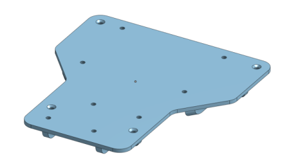
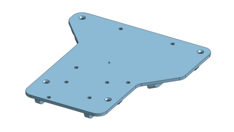

# June
SPARK USEL Future Engineers Engineering Notebooks

***

# 5/30/22
Most of the materials have arrived. Still waiting on ESC and a few bits of hardware.

### Current parts:
* [Schumacher Atom 2 S2 1/12 GT12 Competition Pan Car Kit](https://www.amainhobbies.com/schumacher-atom-2-s2-1-12-gt12-competition-pan-car-kit-schk179/p1055346)
* [Fantom ICON V2 Spec Edition - Sensored Brushless Motor 13.5T](https://fantomracing.com/shop/motors/spec-motors/13-5-icon-v2-works-edition/)
* [Traxxas 48P Pinion Gear w/Set Screw (3.17mm Bore) (19T)](https://urcraceway.com/traxxas-48p-pinion-gear-w-set-screw-3-17mm-bore-19t/)
* [Xceed RC "Enneti" 1/12 Carbon Front Tires (2) (Carbon Black) (40 Shore)](https://www.amainhobbies.com/xceed-rc-enneti-1-12-carbon-front-tires-2-carbon-black-40-shore-xcd101708/p385419?v=209225)
* [Xceed RC "Enneti" 1/12 Carbon Rear Tires (2) (Carbon Black) (30 Shore)](https://www.amainhobbies.com/xceed-rc-enneti-1-12-carbon-rear-tires-2-carbon-black-30-shore-xcd101710/p385420?v=209219)
* [2x Zeee Premium Series 3S LiPo Battery 4200mAh 11.4V High Voltage Battery 120C with XT60 Plug](https://www.ebay.com/itm/384548969557)
* [2x XL6009 DC-DC 5-32V to 1.25-35V Adjustable Converter Module 4 MOSFET Switch DSN6000AUD](https://www.amazon.com/Automatic-Transformer-Adjustable-Converter-DSN6000AUD/dp/B07LH9H14J)
* [Savox SV1260MG - Mini Digital High Voltage Servo 7.4V](https://www.savoxusa.com/products/savsv1260mg-mini-digital-high-voltage)
* [Woltechz LiPo Battery Charger/Balance/Discharger 1S-6S DC/AC Power Supply for NiMH/NiCD/Li-PO/Li-Fe/Li-ion/PB Packs](https://www.amazon.com/Sky-toy-ST-B6AC-Discharger-Connectors/dp/B07KDSGJFD)
* [ToyBrick TB-RK3399ProD](https://t.rock-chips.com/en/portal.php?mod=view&aid=4) (wrong board)

### Waiting on delivery:
* [HobbyWing QUICRUN 10BL60 Brushless ESC](https://www.hobbywingdirect.com/products/quicrun-wp-10bl60)
* [NVIDIA Jetson Nano](https://developer.nvidia.com/embedded/jetson-nano-developer-kit)
* Some hardware (M3 spacers, standoffs)

### Progress:
The main chassis has been assembled, except for the ESC. The second layer is not finalized as not all the parts have arrived.

[Spec sheet for Jetson Nano](https://developer.download.nvidia.com/assets/embedded/secure/jetson/Nano/docs/NV_Jetson_Nano_Developer_Kit_User_Guide.pdf?aJ8W6GWivAd7V9OS_o_qsSn7KA77QyiE0PEwfwRWNeehVAX9npbFyM8k9_gv23UKbhmdqrOPE5fmew42qneyc7aQuFmsc3kmDEYXGVIkD1VZQqRESb1ckKkN1tgdD8N23PqjXjPDW5a5W5Tmm1hMIftq4S3DHkGNtKmrRz6JtQRNGpfv7O_eLdTq8whnvaFBcaU&t=eyJscyI6ImdzZW8iLCJsc2QiOiJodHRwczpcL1wvd3d3Lmdvb2dsZS5jb21cLyJ9)

***

# 6/4/22

### Updates:
* Jetson Nano has arrived
* Arducam arrived
* The voltage regulators have been replaced with slightly larger ones
* ESC is still in shipping
* Standoffs and spacers have arrived
* The 3D-printed top board is almost ready for printing

### Current parts:
* [Schumacher Atom 2 S2 1/12 GT12 Competition Pan Car Kit](https://www.amainhobbies.com/schumacher-atom-2-s2-1-12-gt12-competition-pan-car-kit-schk179/p1055346)
* [Fantom ICON V2 Spec Edition - Sensored Brushless Motor 13.5T](https://fantomracing.com/shop/motors/spec-motors/13-5-icon-v2-works-edition/)
* [Traxxas 48P Pinion Gear w/Set Screw (3.17mm Bore) (19T)](https://urcraceway.com/traxxas-48p-pinion-gear-w-set-screw-3-17mm-bore-19t/)
* [Xceed RC "Enneti" 1/12 Carbon Front Tires (2) (Carbon Black) (40 Shore)](https://www.amainhobbies.com/xceed-rc-enneti-1-12-carbon-front-tires-2-carbon-black-40-shore-xcd101708/p385419?v=209225)
* [Xceed RC "Enneti" 1/12 Carbon Rear Tires (2) (Carbon Black) (30 Shore)](https://www.amainhobbies.com/xceed-rc-enneti-1-12-carbon-rear-tires-2-carbon-black-30-shore-xcd101710/p385420?v=209219)
* [2x Zeee Premium Series 3S LiPo Battery 4200mAh 11.4V High Voltage Battery 120C with XT60 Plug](https://www.ebay.com/itm/384548969557)
* 2x unknown DC to DC voltage regulator
* [Savox SV1260MG - Mini Digital High Voltage Servo 7.4V](https://www.savoxusa.com/products/savsv1260mg-mini-digital-high-voltage)
* [Woltechz LiPo Battery Charger/Balance/Discharger 1S-6S DC/AC Power Supply for NiMH/NiCD/Li-PO/Li-Fe/Li-ion/PB Packs](https://www.amazon.com/Sky-toy-ST-B6AC-Discharger-Connectors/dp/B07KDSGJFD)
* [NVIDIA Jetson Nano](https://developer.nvidia.com/embedded/jetson-nano-developer-kit)
* [Arducam IMX219 Fixed Focus Camera Module for Nvidia Jetson Nano](https://www.arducam.com/product/b0191-arducam-imx219-visible-light-fixed-focus-camera-module-nvidia-jetson-nano-raspberry-pi-compute-module/)

***

# 6/5/22

### Updates:
* CAD model for changes made - The Jetson Nano is now rotated 90 degrees to prevent the Arducam's ribbon cable from twisting
* Voltage regulators have been rotated to make soldering easier
* ESC has arrived

### Changes to be made
* [XT 60 battery connectors](https://www.amazon.com/OOOUSE-XT60-Connector-Pairs-pairs/dp/B005FAPYXS) need to be purchased to match connectors on battery
* Special connectors for the servo and ESC have to be made (More to elaborate)

The servo requires a voltage input of 5-7.4V, and the ESC has an output of 6V on the wire to the "receiver". Since we are not using a receiver the 6V power and ground wires on the ESC connector must be removed,leaving a single pin for the PWM input. The servo should not be driven directly from the Jetson Nano since it will only take 5 volts and may draw a lot of current. There are two voltage regulators - one to power the Jetson Nano at 5V and the other can be used to power the servo at 7.4V. Therefore, the connections to the servo and ESC must be modified. The BEC in the ESC must be completely bypassed and the 7.4V input for the servo must be separated to the voltage regulator and the PWM pin for both have to go to the Jetson Nano.

Banana plugs will be soldered to the ESC's ABC connections, to make it removable. A 3-way splitter will be made by soldering 3 16 gauge wire together into one connector.
'
***

# 6/7/22

### Updates:
* Soldered ESC to motor and power
* Tested motor

The motor is too high kV, so it runs way too fast and does not seem to have maximum torque at low RPM. Switching out the motor for a lower kV motor will be better since having a finer range of speed and higher initial torque is better for this application.

Initial tests resulted in the motor starting at full speed and sending the wheels flying off - the clamps for the left wheel weren't tight enough. There's also silicone lubricant everywhere. A higher reduction probably would also help. Since we are using the smallest spur gear we can, we plan to buy a bigger differential gear and put in a smaller spur gear for lower speed and better torque.

***

# 6/11/22

###