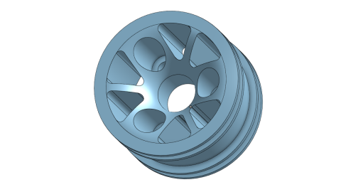

# October 2022
SPARK WRO 2022 Future Engineers Engineering Notebooks

***

# 10/1/22
We did work on wiring the LEDs. The plan is to use the BEC output of the ESC to supply 6V to the LEDs, which can draw up to 2 Amps, so in theory the BEC should be able to drive them. When the ESC is switched off, the BEC output is also off, so we won't waste battery when idling. Also, we're printing the new platform, which prints way slower than it could be printed because the layer height is uselessly thin and the top-bottom speed is too low.

# 10/2/22
Terrible print quality. 20 hours. Nothing fits except for the screws. Actually, not even the screws fit. With the same dimensions, somehow the screw holes don't line up, the antenna mounts are the wrong size, and the switch inset is 1mm too small even thought it was sized 1mm up.

Also, the LEDs are so bright that they overheat and draw too much current.

# 10/5/22
Today we worked on improving the new system. It can now discern whether a wall is in front of the car or to the side. Mostly. There are cases where it turns to almost face the inner wall and attempts to turn the wrong direction, thinking that it's reached a turn.

# 10/6/22
New wheel design - we're switching to LEGO wheels - or more specifically, their 49.5x20mm tires. We modified our existing rim to fit the new tire, which is slightly larger. We did this because the spur diff gear touches the ground when we drive on our existing wheels, which can cause damage to the gear and also collect lots of dust.

# 10/9/22
The lights are so bright that they're causing some issues. The reflection off the mat is strong enough to cause the brightness to lower and the colors to change. We can combat this by placing a shield on the bottom preventing light from reaching the floor.

# 10/17/22
We don't need lights anymore. We've decided that lights will be unneccesar, and the competition mat should be evenly lit. We'll remove the lights and change nothing else.

# 10/22/22
Got new motor. Does anyone even read these?

It's a lot slower (less than half the speed) but doesn't fit in the chassis. We may have used a dremel to make it fit.

Details: We got a quicrun 3650 because it has a lower kV rating and will allow us to move at lower speeds. However, the motor is barely short enough to fit in the mount, and if the car is rolled left, the motor gets stuck and the car is left with a permanent left roll. We considered preventing roll on the rear axle completely by locking it with bolts but the threaded inserts on ours are broken and we can't remove the springs to replace them with bolts. Our solution was to grind off 1mm of material on the cutout in the frame.

It still doesn't fit because the protrusion is 15mm, while the maximum allowable protrusion is 10mm. So now we either keep using the old one (and unsolder connectors) or buy a new one (and unsolder connectors). And now we have a patch of exposed steel in the chassis.

Instead of choosing either of those options, we ground away more of the chassis instead.

To avoid putting "grind off part of the chassis" in the instructions the 22.5T version of the original Fantom motor will be used instead.