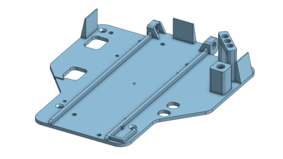

# September 2022
SPARK WRO 2022 Future Engineers Engineering Notebooks

***

# 9/17/22
We've recieved the email that we're competing in the internationals this year. We have some proposed changes to be made:
- Redesign camera mount to be higher up, making it easier to judge the location of walls
- Add LEDs to reduce the effects of uneven ambient lighting
- Change wall detection code to check the slope of the detected walls instead of assuming the locations based on the area of the image it's in
- Reduce thickness of rear wheels to prevent them from knocking over traffic signals we drive past

A new camera mount was designed; it used the four posts that the upper steering knuckle support uses rather than the holes for the body posts. There are indents in the forward screw holes on the bracket to allow for the new LED mounts.

# 9/18/22
Printing the new camera mount proved to be more difficult than expected. There was dust on the filament because we had left it sitting in a corner, making the extrusions messy and making half the print unusable. The printing speed may have been too fast, and the cooling fan couldn't cool the extruded material fast enough, resulting in warping and more messy spots. The messy edges of the print meant that the LED clips that fit over the mounting hardware doesn't fit.
On the positive side, the mounting holes lined up really well and the camera seems to be in a much better position with this bracket.

Also, there aren't any 1:12 scale 40mm wheels for our specific mounting pattern, so we ordered some tires off of Amazon and began designing our own wheels.

# 9/19/22
Below is the final design for our custom wheel hub. It has a small diameter of 28mm to fit the [new wheels](https://www.amazon.com/gp/product/B09YHC4NDS/).

The first print was "alright". The wheel fit onto the hub and the screw holes lined up. The hub is a bit too wide and is missing extra insets for the M3 bolt heads used to hold it onto the axle.

# 9/20/22
Multiple different prints resulted in unusable results. The inside face of the wheel hub was recessed to reduce the profile of the wheel (by 1mm) and without supports, it would collapse immediately. With supports, they're unremovable and the slicer places excessive amounts of them. There's still warping as well.

# 9/24/22
Yesterday the wheels finished printing. Today we put them on. Now we have wheels. The prints were warping slightly, but they were still usable. The camera bracket, on the other hand, warped so badly that none of them were actually good. The issue is that since the object is so small with so many details, the print head spends more time there, putting more heat into the already extruded material, melting it. This happens every time a layer is added, resulting in warped and messy prints. The solution was to lower the extrusion temperature to 180 degrees Celsius so it wouldn't add too much heat to existing material but also still melted the PLA being extruded.

We also got a set of [5W LEDS](https://www.amazon.com/6000K-6500K-600mA-700mA-Intensity-Components-Lighting/dp/B01DBZJBIW), which we will design a mount for today. The idea is to put a recess in a plate with holes for the tabs on the sides to pass through. The tolerances for this method are really tight, though.

We also made a fifth revision of the top platform, integrating the indicator LEDs and the new start button into the plate (as well as some space for our logo).

# 2/26/22
Today a battery was found to be at 0 volts. Not sure if it's still safe to use, people on the internet say that it could catch fire if charged. Hopefully that doesn't happen.

In other news, we're working on improving the wall detection code. Instead of assuming that the right side of the image is always going to be a right wall, the left always the left wall, and the center always the far wall in front, we now divide the image into 6 sections, and check the slope of the wall in each section using the [RANSAC Regression algorithm](https://scikit-learn.org/stable/modules/generated/sklearn.linear_model.RANSACRegressor.html). This will reduce the chances of a false detection. For example, in a turn of one specific case a wall in front of the car was assumed to be to the right of the car, so it turned left because "the right wall is huge".

In even more other news, the new camera bracket and LED brackets are mounted on 35mm brass standoffs extending up from the top of the front wheel plate.

The LED brackets are sandwiched between the screw and the camera bracket, and is locked in place by the negative imprint of the camera bracket "foot".

