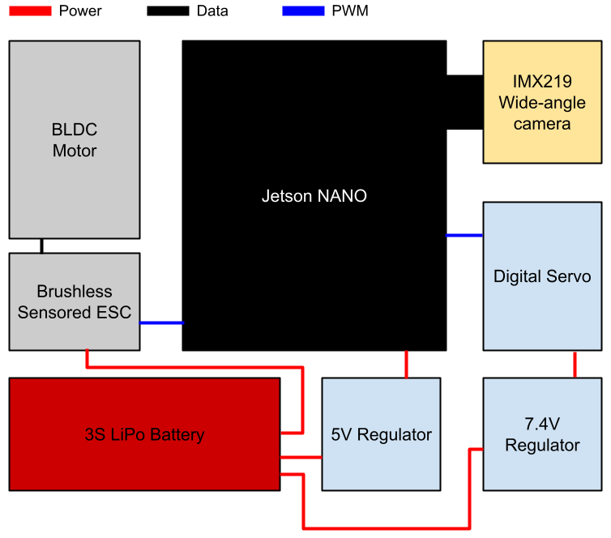
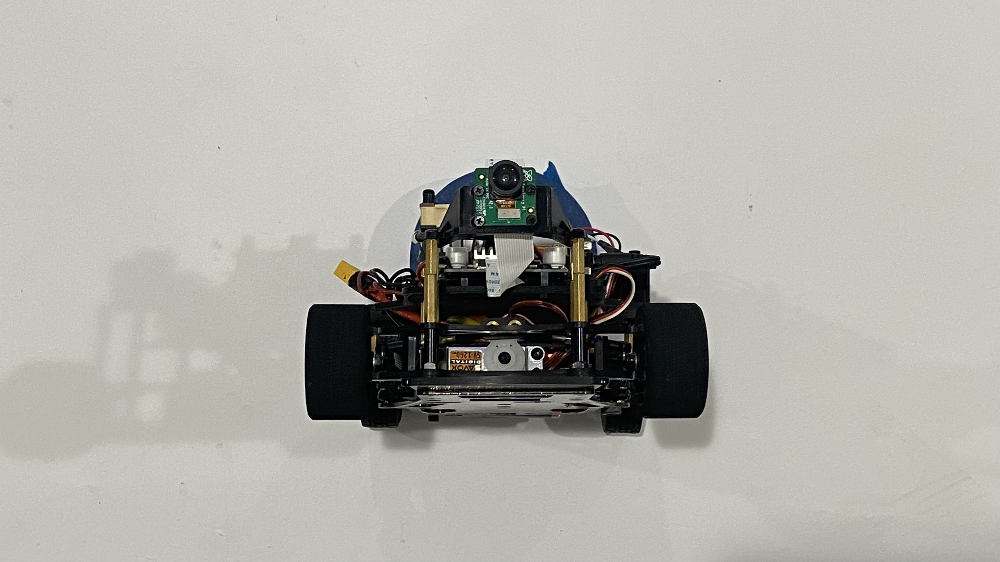
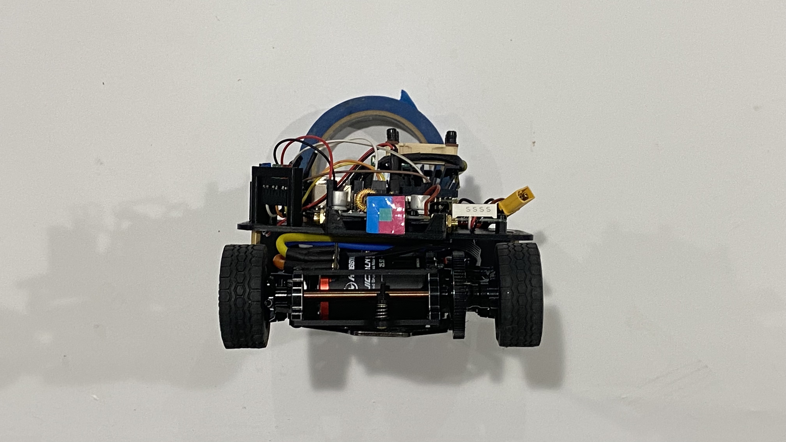
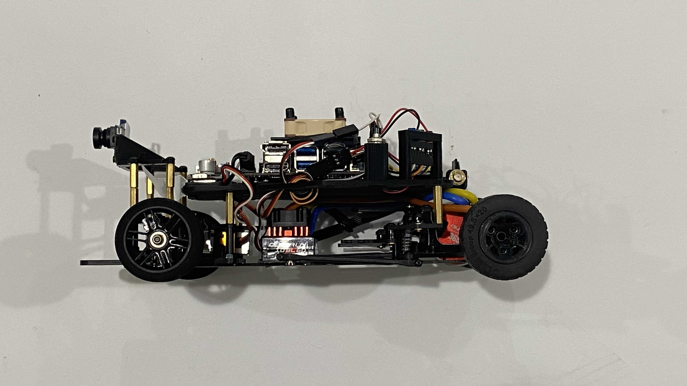
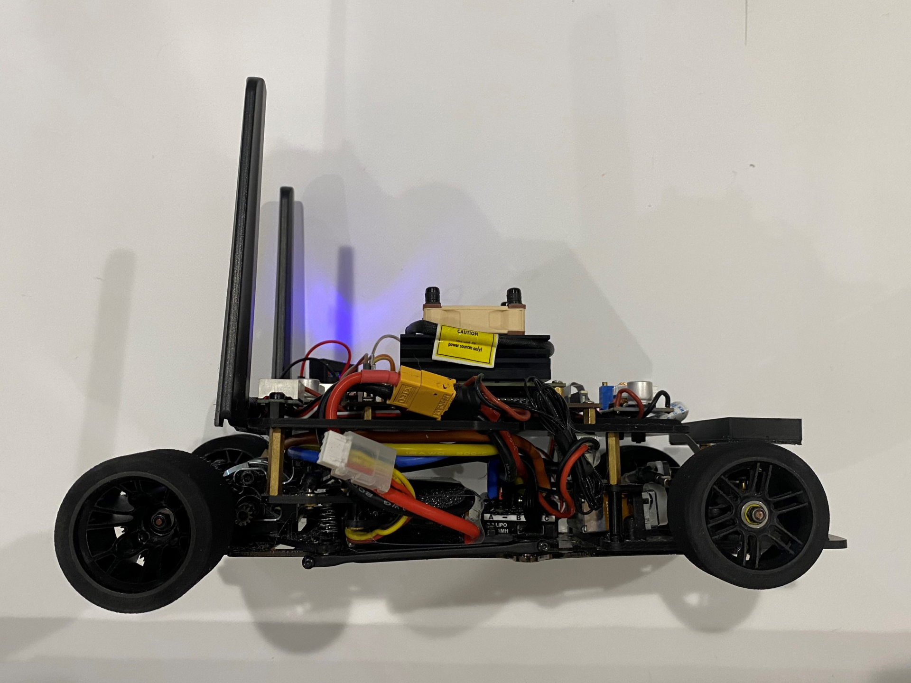
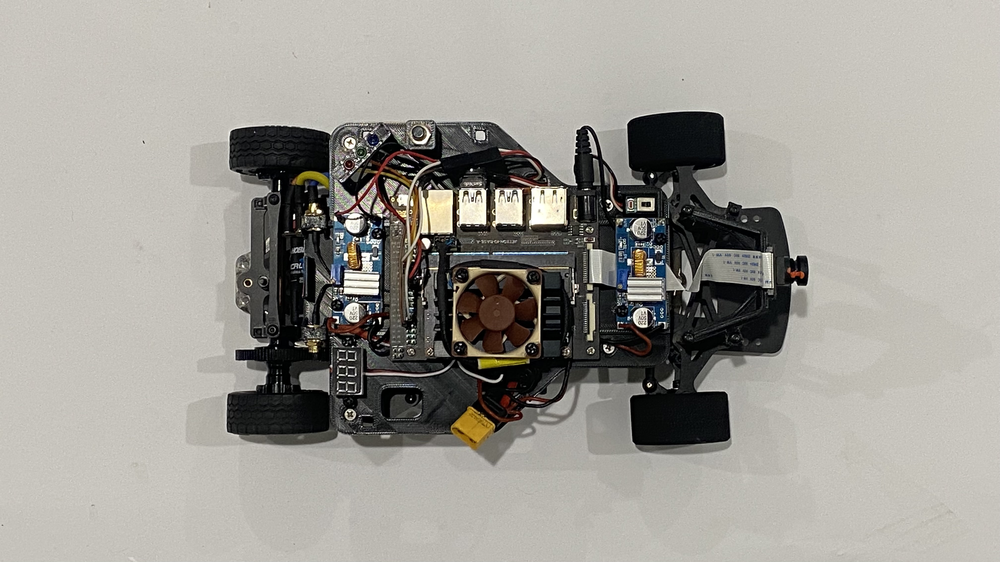
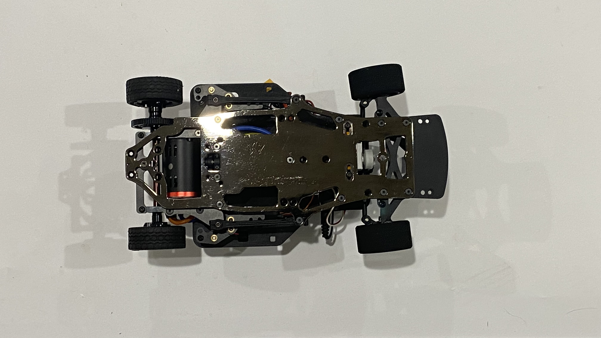
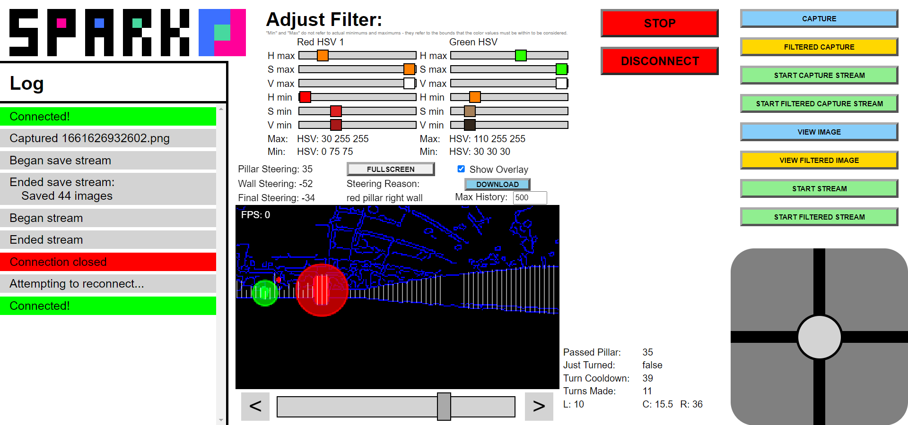

***

**Official GitHub repository for WRO USA team SPARK Future Engineers 2022. All code, documentation, and files are located here.**

Located below is the documentation, and a link to the build instructions.

***

# Contents
* [Hardware Overview](#the-hardware)
    * [Parts List](#parts-list)
    * [Assembly Instructions](#assembly)
    * [Electromechanical Diagram](#electromechanical-diagram)
    * [Photos](#photos)
* [Software Overview](#the-software)
    * [Operating System](#operating-system)
    * [Programming Language](#programming-language)
    * [IO](#io)
    * [Image Processing and Predictions](#image-predictions)
        * [subtopic](#nonexistent)
    * [SPARK Control Panel](#spark-control)
* [Team Photos](#team-photos)
* [Demonstration Video](#demonstration-video)
* [LiPo Battery Safety Notice](#lipo-battery-safety-notice)

***

# **The Hardware**

## Parts List
* [Schumacher Atom 2 S2 1/12 GT12 Competition Pan Car Kit](https://www.amainhobbies.com/schumacher-atom-2-s2-1-12-gt12-competition-pan-car-kit-schk179/p1055346)
* [HobbyWing QUICRUN 10BL60 Brushless ESC Sensored](https://www.hobbywingdirect.com/products/quicrun-10-sensored)
* [Fantom ICON V2 Torque Edition - Sensored Brushless Motor 25.5T](https://fantomracing.com/shop/motors/spec-motors/25-5-icon-torque-works-edition/)
* [12 Tooth 48 Pitch Pinion Gear w/Set Screw (3.17mm Bore)](https://www.amazon.com/Traxxas-PINION-PITCH-SCREW-2428/dp/B00EFXMUO2)
* [78 Tooth Spur Gear 48 Pitch](https://www.amazon.com/Kimbrough-Pitch-Spur-Gear-78T/dp/B0006O1QVM)
* [Xceed RC "Enneti" 1/12 Carbon Front Tires (2) (Carbon Black) (40 Shore)](https://www.amainhobbies.com/xceed-rc-enneti-1-12-carbon-front-tires-2-carbon-black-40-shore-xcd101708/p385419?v=209225)
* [Xceed RC "Enneti" 1/12 Carbon Rear Tires (2) (Carbon Black) (30 Shore)](https://www.amainhobbies.com/xceed-rc-enneti-1-12-carbon-rear-tires-2-carbon-black-30-shore-xcd101710/p385420?v=209219) OR [LEGO 49.5x20mm Tire (Part 15413)](https://www.bricklink.com/v2/catalog/catalogitem.page?P=15413)
* [Savox SV1260MG - Mini Digital High Voltage Servo 7.4V](https://www.savoxusa.com/products/savsv1260mg-mini-digital-high-voltage)
* [Woltechz LiPo Battery Balance Charger Discharger 1S -6S AC/DC for NiMH/NiCD/Li-PO/Li-Fe/Li-ion/PB](https://www.amazon.com/Woltechz-Battery-Charger-Discharger-Multi-Charging/dp/B07KDSGJFD/)
* [2x Zeee Premium Series 3S LiPo Battery 4200mAh 11.4V High Voltage Battery 120C with XT60 Plug](https://www.ebay.com/itm/384548969557)
* [2x Variable DC Voltage Buck Converter](https://www.amazon.com/Regulator-Adjustable-Converter-Electronic-Stabilizer/dp/B07PDGG84B/ref=sr_1_18)
* [Male 5.5mm DC Barrel Connector Pigtails](https://www.amazon.com/Pigtails-Female-Connector-Pigtail-Security/dp/B08PYWN3T7/)
* [DC Digital Voltometer](https://www.amazon.com/bayite-Digital-Voltmeter-Display-Motorcycle/dp/B00YALUXH0/)
* [Normally Closed Push Button Momentary On Switch (size must match)](https://www.amazon.com/Pieces-normally-closed-Button-Momentary/dp/B07HCLVMGS/)
* [Yahboom Jetson Nano 4GB Developer Kit](https://category.yahboom.net/collections/jetson/products/jetson-nano-sub)
* [Arducam Raspberry Pi Official Camera Module V2, with 8 Megapixel IMX219 Wide Angle 175 Degree Replacement](https://www.amazon.com/Arducam-Raspberry-Official-Megapixel-Replacement/dp/B083PW4BLH/)
* [Intel AX201 WiFi 6 BT 5.1 M.2 2230 with 10in RP-SMA Antenna (not required)](https://www.newegg.com/p/0XM-009Y-001C7)
* [Noctua NF-A4x10 5V (not required)](https://noctua.at/en/products/fan/nf-a4x10-5v)
* 20-24 gauge wire
* 25mm M3 brass spacers
* 20mm, 15mm M3 brass standoffs
* 6mm M3 nylon standoffs
* M3 nylon nuts
* 6mm countersunk M3 screws
* 6mm M3 nylon screws
* 4mm M2.5 screws

*Our build uses a different 25.5T brushless motor from HobbyWing but we had to modify our chassis to make it fit. The code will still work with the motor in this list.*

3D printed parts were used in our build, and all CAD files are located in the folder [/Documentation/CAD/](https://github.com/definitely-nobody-is-here/SPARK_Future-Engineers_2022/tree/master/Documentation/CAD). They're also linked here:
* [Platform](https://github.com/definitely-nobody-is-here/SPARK_Future-Engineers_2022/raw/master/Documentation/CAD/SPARK2022_platform.stl)
* [Camera Mount](https://github.com/definitely-nobody-is-here/SPARK_Future-Engineers_2022/raw/master/Documentation/CAD/SPARK2022_cameramount.stl)
* [Rear Wheel Rim](https://github.com/definitely-nobody-is-here/SPARK_Future-Engineers_2022/raw/master/Documentation/CAD/SPARK2022_rearwheelrim.stl) (if not using Xceed rear tires)
<!-- * [Camera LED Clip](https://github.com/definitely-nobody-is-here/SPARK_Future-Engineers_2022/raw/master/Documentation/CAD/SPARK2022_cameraLEDmount.stl) -->
## Assembly

We followed the instructions for the Atom 2 pan car kit, and then added the platform, wheels, and electronics. The ESC is VHB taped to the metal chassis, and the motor is mounted with the 12 tooth pinion gear. We swapped the stock 64 tooth spur gear to a new 78 tooth spur gear to lower our speed and give slightly more torque. The wires going to the voltage regulators can be soldered directly into the XT-60 connector with the ESC power leads. The voltage regulators and voltage meter can be screwed into standoffs with nylon screws on the upper platform.

The two RP-SMA connectors for the WiFi card (not required but good for development) can be routed to the back of the platform into their brackets. The NF A4x10 can be screwed into the heatsink of the Jetson NANO Developer Kit using 4 long nylon screws, but the holes will first have to be tapped or "tapped" by metal screws. The fan is also not required but can help (the board does reach fairly high temperatures at times).

The top platform is mounted onto existing locations on the car. In the rear two spacers are screwed into the mounting locations for the rear body posts. In the front, the screws for the bracket above the steering servo are replaced with standoffs.

The camera and LEDs are mounted on top of standoffs extending the top of front wheel plate.

#### **For a detailed build guide, go to [ASSEMBLY.md](./ASSEMBLY.md)**
## Electromechanical Diagram

Here is a simple electromechanical schematic for how the electronics are wired:

***

## Photos
| | |
| ------------------------- | --------------------------- |
|  |      |
|    |    |
|      |  |

***

# **The Software**

## **Operating System**

We used Jetson Nano's operating system, which is Ubuntu 18.04. It has been changed to text-only mode to remove the unneccesary GUI. We also added a startup script ([see "Board Setup" in Assembly.md](./ASSEMBLY.md#board-setup-sshfs-and-static-ip)) to run the program on startup, which waits for a button press before running the program.

## **Programming Language**

All our code is in python (except the SPARK Control Panel and SPARK Randomizer, those are HTML/JS/CSS documents that aren't uploaded or used in runs). We use `os`, `time`, `threading`, `numpy`, `cv2`, `base64`, `threading`, `asyncio`, `Jetson.GPIO`, `jetcam`, `json`, `websockets`.

The **entire** `Program` directory must be uploaded in order for the program to run.

## **IO**
The camera is handled by the `jetcam` library, which we can read the most recent frame into a `numpy` array, which we then process.

The drivetrain of the car is handled separately by the controller in the servo and the ESC. We feed them a pulse of a specific width (time) to control their speed/angle. However, due to a software limitation in the `Jetson.GPIO` library, we only jave 5 throttle steps, meaning we don't have as fine throttle control as desired. This can possibly be fixed with a solution that could be described as "hacky", however we haven't tried it.

***

## **Image Predictions**

All the code for image filtering and predictions can be found in `/Program/AI/filter.py`.

The filter function takes in a raw image and outputs a filtered image. This image is filtered based on 6 HSV values, `redMax`, `redMin`, `greenMin`, `greenMax`, `blueMin`, `blueMax`. Using `cv2.cvtColor`, we can convert the RGB image captured by the camera to a HSV image, and using `cv2.inRange`, we can filter the image based on these values, to get a mask of the pillars. The blue mask is used to detect the blue lines on the ground. There used to be another pass to filter in the walls, but that was phased out in favor of a new method. This method is unreliable in spaces with dark areas and places with a lot of glare. Instead, after using `cv2.cvtColor` to turn the image into a grayscale image, `cv2.GaussianBlur` to blur the image, we use `cv2.Canny` to get a black and white image highlighting edges.

The predict function is where all the predictions happen. There are three sections to it, pillar steering, wall steering, and turn detection.

Pillar steering starts by creating a blob detector using `cv2.SimpleBlobDetector` and using `SimpleBlobDetector_Params` to set the parameters. Using the filtered red and green images, the blob detector detects blobs to filter out random noise in the image and get the relative position and relative size of the pillars. We have two equations, `getRedEquation` and `getGreenEquation`. These calculate if we will hit a pillar or not, and we use it on all the blobs detected by the blob detector. If there are pillars detected, we take the largest pillar. Using a combination of the size of the pillar and the location of the pillar, we calculate a steering value on which direction we should turn. This is stored in `pillarSteering`. The steering value is also written in `passedPillar`, as `passedPillar` is used when we pass a pillar to prevent the back wheels from hitting the pillar.

Next we have wall steering. First we start by cropping out the top 79 pixels. Due to the way the camera is placed, it is exactly the same height as the wall, so no matter where the wall is, the top line is nearly constant, and is around 79 pixels. After this, we swap the axes to prepare for wall height detection. Using `numpy.argmax` we find the bottom of the wall. We split the image into 8 sections. Taking the differences, we can find the slope of each section, and catagorize the sections. If the slope is less than -0.2, it is catagorized as a left wall. If the slope is more than 0.2, it is catagorized as a right wall. Otherwise, it is catagorized as a center wall. The first two sections on the left side are always left walls and the first two sections on the right side are always right walls. If there is a sudden jump in the height of the wall, we know the higher wall cannot be a center wall, and must either be a left wall or a right wall.

Now, we loop through all 8 wall sections. Based on the position and height of the wall, we calculate a steering value. At the end, we have 3 values, one for all the left walls, one for all the right walls, and one for all the center walls. We take the maximum.

On the first frame, we look for a jump in either the left wall or the right wall. This tells us if we are driving clockwise or counterclockwise, as the side with the jump must have a gap in the wall.

If there are more than 500 blue pixels on the screen we increase `turnsMade` by one, and if we have turned 12 times, or 3 laps, it returns "stop", causing the car to stop.

A negative steering value means we turn left, while a positive means turning right.

After this, we send all this information to SPARK Control.

Finally, it takes the sum of the pillar steering and wall steering and returns it.

***

## **SPARK Control**
SPARK Control is our own testing and debugging software. It consists of a WebSocket server running on the Jetson NANO, and a local HTML document on our computers. The page uses a WebSocket connection to communicate with the server. The server can broadcast and recieve data in the form of JSON strings, which allows for the differentiation of events and more complex data transfers. The system is modular and is simple to use. As long as the data can be converted to JSON, it can be sent. Broadcasting is as simple as specifying an event name and some data to be sent. To recieve messages, it is possible to add an event listener, which is a function that is run when the specified event is recieved.

The client control panel consists of a log, which is appended to by the `message` event; filter tuning sliders for changing the ranges of the image preprocessor; capture buttons to save and stream raw and filtered images, and the ability to control the vehicle when running in manual drive mode. The data display can show raw and filtered image streams from the car's camera, visualize the detected blobs and wall heights, and display output data from the code. By default, the last 500 frames of data are saved in history and can be replayed for debugging.

***

# Team Photos

***

# **Demonstration Video**

[Demo video: Display video](https://youtu.be/4ExFMHKP9r8)

[Demo video: No traffic signals, normal walls](https://youtu.be/QAQedR-BHWs)

[Demo video: No traffic signals, extended walls](https://youtu.be/rsylY0rOz3Y)

[Demo video: With traffic signals](https://youtu.be/jMQYSYyJUZc)

# LiPo Battery Safety Notice

While LiPo batteries are the safest form of portable, affordable, high density energy storage, there are still precautions to be taken when working with them. Lithium is a highly volatile element, and will react with the water vapor in the air if exposed to it.

1. **Do not** puncture, deform, short, or heat LiPo batteries above 80° F
2. Store and charge LiPos in a *fireproof container* **away** from flammable materials and water
3. **NEVER** charge a swollen or damaged battery (e.g. damaged leads, swelling of cells, puncture in wrapping)
4. **NEVER** leave a charging battery unattended
5. Only charge LiPo batteries with chargers *designed for LiPo batteries*
6. Dropping a battery can cause sufficient damage to rupture a cell and cause shorts
7. Overdischarging a LiPo battery can cause **permanent damage**

If a LiPo battery goes below its minimum voltage (stated in the manual included or 3.3v multiplied by the amount of cells connected in series) it can cause **permanent internal damage**. This damage is not visible until after further use, when it can swell, or potentially burst and **cause a FIRE**.

**Read all safety notes and instructions included with LiPo batteries before use.**

### For a more detailed LiPo safety manual there is one on [Tenergy Power](https://power.tenergy.com/lipo-safety-warnings/)