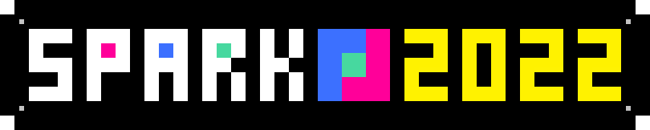

# SPARK_Future-Engineers_2022

# The Hardware

6 (perspective) views of our car:

# The Software

## IO
insert documentation about drive throttling and camera

## Image filtering
explain image filters here

## SPARK Control
SPARK Control is our own debugging and testing software. It consists of a WebSocket server running on the car, and a local HTML page on our computers. The page uses a WebSocket connection to communicate with the server on the car. The server can broadcast and recieve data in the form of JSON strings, which allows for the differentiation of events and complex data transfers. The system is modular and is simple to use. As long as the data can be converted to JSON, it can be sent. Broadcasting is as simple as specifying an event name and some data to be sent. To recieve messages, add an event listener, which is a function that is run when the specified event is recieved.

The client control panel consists of a log - which can be appended to by sending a `message` event and some text; filter tuning sliders for changing the ranges of the image filter; capture buttons to save and preview images; and a data display to view what's happening inside the programs running on the car, which will be explained later. The data display can show raw and filtered image streams from the car's camera, visualize the size and location of blobs from the blob detector, and output the predicted steering values from the filter. By default, the last 500 frames of data are saved in history and can be replayed for debugging.

