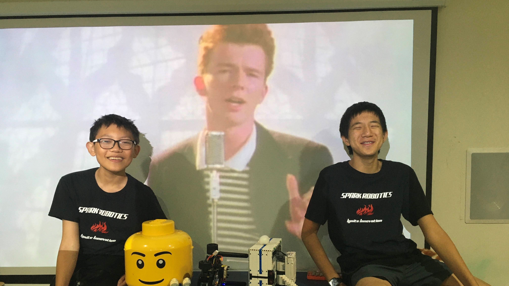

***

# **The Hardware**

### Parts List
* [Schumacher Atom 2 S2 1/12 GT12 Competition Pan Car Kit](https://www.amainhobbies.com/schumacher-atom-2-s2-1-12-gt12-competition-pan-car-kit-schk179/p1055346)
* [HobbyWing QUICRUN 10BL60 Brushless ESC](https://www.hobbywingdirect.com/products/quicrun-wp-10bl60)
* [Fantom ICON V2 Spec Edition - Sensored Brushless Motor 13.5T](https://fantomracing.com/shop/motors/spec-motors/13-5-icon-v2-works-edition/)
* [12 Tooth 48 Pitch Pinion Gear w/Set Screw (3.17mm Bore)](https://www.amazon.com/Traxxas-PINION-PITCH-SCREW-2428/dp/B00EFXMUO2)
* [78 Tooth Spur Gear 48 Pitch](https://www.amazon.com/Kimbrough-Pitch-Spur-Gear-78T/dp/B0006O1QVM)
* [Xceed RC "Enneti" 1/12 Carbon Front Tires (2) (Carbon Black) (40 Shore)](https://www.amainhobbies.com/xceed-rc-enneti-1-12-carbon-front-tires-2-carbon-black-40-shore-xcd101708/p385419?v=209225)
* [Xceed RC "Enneti" 1/12 Carbon Rear Tires (2) (Carbon Black) (30 Shore)](https://www.amainhobbies.com/xceed-rc-enneti-1-12-carbon-rear-tires-2-carbon-black-30-shore-xcd101710/p385420?v=209219)
* [Savox SV1260MG - Mini Digital High Voltage Servo 7.4V](https://www.savoxusa.com/products/savsv1260mg-mini-digital-high-voltage)
* [Woltechz LiPo Battery Balance Charger Discharger 1S -6S AC/DC for NiMH/NiCD/Li-PO/Li-Fe/Li-ion/PB](https://www.amazon.com/Woltechz-Battery-Charger-Discharger-Multi-Charging/dp/B07KDSGJFD/)
* [2x Zeee Premium Series 3S LiPo Battery 4200mAh 11.4V High Voltage Battery 120C with XT60 Plug](https://www.ebay.com/itm/384548969557)
* [2x Variable DC Voltage Buck Converter](https://www.amazon.com/Regulator-Adjustable-Converter-Electronic-Stabilizer/dp/B07PDGG84B/ref=sr_1_18)
* [DC Digital Voltometer](https://www.amazon.com/bayite-Digital-Voltmeter-Display-Motorcycle/dp/B00YALUXH0/)
* [Yahboom Jetson Nano 4GB Developer Kit](https://category.yahboom.net/collections/jetson/products/jetson-nano-sub)
* [ArduCam 8MP IMX219 with M12 175 Ultra Wide Angle Camera](https://www.arducam.com/product/8mp-imx219-175-degree-ultra-wide-angle-raspberry-pi-b0392/)
* [Intel AX201 WiFi 6 BT 5.1 M.2 2230 with 10in RP-SMA Antenna (not required)](https://www.newegg.com/p/0XM-009Y-001C7)
* [Noctua NF-A4x10 5V (not required)](https://noctua.at/en/products/fan/nf-a4x10-5v)
* 24 Gauge wire

3D printed parts were used in our build, and all CAD files can be found in the [repository](https://github.com/definitely-nobody-is-here/SPARK_Future-Engineers_2022/tree/master/Documentation/CAD). They're also linked here:
* [Top Platform](https://github.com/definitely-nobody-is-here/SPARK_Future-Engineers_2022/raw/master/Documentation/CAD/SPARK2022_platform.stl)
* [Camera Mount](https://github.com/definitely-nobody-is-here/SPARK_Future-Engineers_2022/raw/master/Documentation/CAD/SPARK2022_cameramount.stl)
* [LED Mount (not required)](https://github.com/definitely-nobody-is-here/SPARK_Future-Engineers_2022/raw/master/Documentation/CAD/SPARK2022_LEDmount.stl)

### Assembly

We followed the instructions for the Atom 2 pan car kit, and then added the platform, wheels, and electronics. The ESC is VHB taped to the metal chassis, and the motor is mounted with the 12 tooth pinion gear. We swapped the stock 64 tooth spur gear to a new 78 tooth spur gear to lower our speed and give slightly more torque. The wires going to the voltage regulators can be soldered directly into the XT-60 connector with the ESC power leads. The voltage regulators and voltage meter can be screwed into standoffs with nylon screws on the upper platform.

The two RP-SMA connectors for the WiFi card (not required but good for development) can be routed to the back of the platform into their brackets. The NF A4x10 can be screwed into the heatsink of the Jetson NANO Developer Kit using 4 long nylon screws, but the holes will first have to be tapped or "tapped" by metal screws. The fan is also not required but can help (the board does reach fairly high temperatures at times).

The top platform is mounted onto existing locations on the car. In the rear two spacers are screwed into the mounting locations for the rear body posts. In the front, the screws for the bracket above the steering servo are replaced with standoffs. This ensures that the mounting is secure. The camera mount is attached to the mounts for the front body posts.

### Electromechanical Diagram

Here is a simple electromechanical schematic for how the electronics are wired:

***

### 6 (perspective) Views
| | |
| ------------------------- | --------------------------- |
|  |      |
|    |    |
|      |  |

***

# **The Software**

## **Operating System**

We used Jetson Nano's operating system, which is Ubuntu 18.04. We switched it to text-only mode since we encountered errors that prevented booting in GUI mode. We also added a startup script ([see Notes.md](./Notebook/Notes.md)) to run the program on startup, and it waits for two pins to be shorted. We're not sure if it's reliable yet.

## **Programming Language**

All our code is in python (except the SPARK Control Panel, but that won't be used in competition). We use `os`, `time`, `threading`, `numpy`, `cv2`, `base64`, `threading`, `asyncio`, `Jetson.GPIO`, `jetcam`, `json`, `websockets`.

## **IO**
The camera is handled by the `jetcam` library, which we can read the most recent frame into a `numpy` array, which we then process.

The drivetrain of the car is handled separately by the controller in the servo and the ESC. We can feed two PWM signals of specific pulse widths to them to control their speed/angle. However, speed control is not as straightforwards as steering control. The ESC was designed for RC hobby use, so it has a "dead zone" in the forwards throttle range of 6%. Since we are running the motor way below its rated speed, the 6% dead zone actually takes up our entire desired throttle range, making the minimum speed too high to be usable. To solve this, we can "feather" the throttle, which is actually just another PWM on the PWM. After implementing and tuning this, we can go much slower.

***

## **Image Predictions**

All the code for image filtering and predictions can be found in `/Program/AI/filter.py`.

The filter function takes in a raw image and outputs a filtered image. This image is filtered based on 6 RGB values, `redMax`, `redMin`, `greenMin`, `greenMax`, `wallMin`, `wallMax`. We use `cv2`'s `inRange` function to filter the image based on these values.

The predict function is where all the predictions happen. It starts by creating a blob detector using `cv2.SimpleBlobDetector`. This is from a package. `SimpleBlobDetector_Params` is only for setting the parameters for the blob detector. After this, it takes the raw image from the input and passes it to the filter function. After this, it uses the blob detector on the filtered red and green images to detect red and green pillars. Now it does wall detection. First, it crops the image, removing the top and bottom sections, and then using `numpy.count_nonzero` as a fast way to get how many filtered wall pixels there are. There are 3 sections of the wall that we care about, the left side, center, and right side. Using the `last_nonzero` function from `numpy`, we can find the bottom line of the 3 sections of walls, as this is useful for making predictions based on the walls. We have two equations, `getRedEquation` and `getGreenEquation`. These calculate if we will hit a pillar or not, and we use it on all the blobs detected by the blob detector. After this, it sends all this information to the SPARK Control Panel. If the center wall is very tiny, the car knows it just turned and increases `turnsMade` by one, and if we have turned 12 times, or 3 laps, it returns "stop". It compares the size of the left wall and the right wall, and adds the difference to a variable called `counterClockwise`. Based on if it is positive or negative, we know which direction to move. Negative is clockwise and positive is counter clockwise. After this, we take the largest pillar we will hit and given the pillar size and where it is we get a `pillarSteering`, and this is also written into `passedPillar`. `passedPillar` keeps track of past pillars, and is reduced by 20% every time. `passedPillar` is used if no pillar is detected. This is useful in making sure the back wheel doesn't hit the pillar. Then, there are 4 main cases for wall steering:

**1: Crashing into center wall**

This means the center wall value and right wall values are large. However, if the left wall value is also large, it is the second case. If we are turning clockwise we will turn right and if we are turning counter clockwise we turn left.

**2: Crashing into left wall**

The left wall value is very large, and the center section which is detected as the center wall may be actually the left wall. We will always turn right.

**3: Slanted left**

The left wall value is large. We will always turn right.

**4: Slanted right**

The right wall value is large. We will always turn left.

A negative steering value means we turn left, while a positive means turning right.

Finally, it takes the sum of the pillar steering and wall steering and returns it.

***

## **SPARK Control**
SPARK Control is our own debugging and testing software. It consists of a WebSocket server running on the car, and a local HTML page on our computers. The page uses a WebSocket connection to communicate with the server on the car. The server can broadcast and recieve data in the form of JSON strings, which allows for the differentiation of events and complex data transfers. The system is modular and is simple to use. As long as the data can be converted to JSON, it can be sent. Broadcasting is as simple as specifying an event name and some data to be sent. To recieve messages, add an event listener, which is a function that is run when the specified event is recieved.

The client control panel consists of a log - which can be appended to by sending a `message` event and some text; filter tuning sliders for changing the ranges of the image filter; capture buttons to save and preview images; and a data display to view what's happening inside the programs running on the car, which will be explained later. The data display can show raw and filtered image streams from the car's camera, visualize the size and location of blobs from the blob detector, and output the predicted steering values from the filter. By default, the last 500 frames of data are saved in history and can be replayed for debugging.

***

# Team Photos

***

# **Demonstration Videos (YouTube)**

[WRO 3 laps with pillars](https://youtu.be/0uMp_ExglOw)

[WRO 3 laps without pillars](https://youtu.be/Jp8k1qW5pQU)
